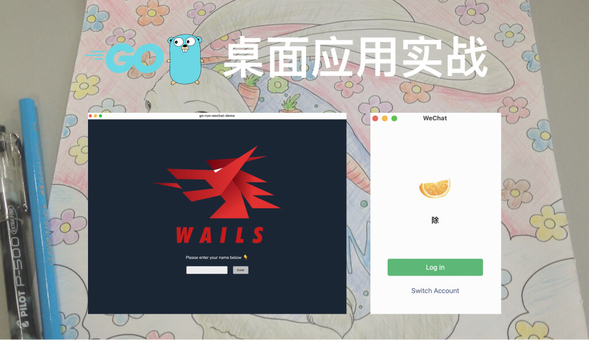

# Go 实战: 使用 Wails 构建轻量级的桌面应用 - 仿微信登录界面 Demo



本仓库使用 Wails v2、Go 和 React，演示仿微信登录界面的实现。两个按钮通过 Wails 调用 Go 方法，再将返回结果显示在页面上。项目没有接入微信服务，也不执行身份认证或保存账号。

- [前言](#前言)
- [运行本仓库](#运行本仓库)
  - [环境要求](#环境要求)
  - [启动应用](#启动应用)
- [创建一个 Wails 项目](#创建一个-wails-项目)
  - [安装 Wails](#安装-wails)
  - [创建新项目](#创建新项目)
  - [项目结构](#项目结构)
- [项目开发: 仿微信登录界面](#项目开发-仿微信登录界面)
  - [进入开发模式](#进入开发模式)
  - [修改代码](#修改代码)
    - [窗口样式和布局](#窗口样式和布局)
    - [后端实现](#后端实现)
    - [前端实现](#前端实现)
- [打包应用](#打包应用)
- [验证修改](#验证修改)
- [总结](#总结)

## 前言

[Wails](https://wails.io/ "Wails") 是一个桌面应用开发框架。本项目使用 [Go](https://go.dev/ "Go") 实现后端方法，使用 [React](https://react.dev/ "React") 和 TypeScript 编写界面。Wails 负责窗口管理、资源加载和前后端调用。

本文重点介绍窗口配置、Go 方法绑定和界面状态更新。应用体积、内存占用和执行性能取决于具体实现，本文不提供性能对比。

以本项目使用的 Wails v2.15.0 为例，主要优势包括:

1. **复用系统渲染引擎**: Wails 使用平台提供的 WebView，无需在应用中捆绑完整浏览器。这有助于控制分发体积，但运行环境仍需具备对应组件。实际体积和资源占用取决于应用实现。
2. **复用 Go 后端能力**: 文件处理、网络请求和业务逻辑可以直接使用 Go 及其生态库。界面使用 Web 技术，后端使用 Go，便于沿用已有代码和工具。
3. **自动生成前后端绑定**: Wails 为绑定的 Go 方法生成 JavaScript 封装和 TypeScript 类型声明。前端可直接发起异步调用，减少手动维护桥接接口的工作。
4. **集成开发与构建流程**: `wails dev` 支持前端更新和 Go 代码自动重建，也提供浏览器调试入口。`wails build` 串联前端构建、资源嵌入和原生打包。使用前仍需安装目标平台的构建依赖。
5. **提供桌面系统交互接口**: 除窗口控制外，Wails 还提供原生菜单、[系统对话框](https://wails.io/docs/reference/runtime/dialog "系统原生的用户界面元素")和剪贴板接口。v2.15.0 也提供[系统通知接口](https://v2.wails.io/docs/reference/runtime/notification/)，便于扩展桌面功能。具体能力和权限要求因平台而异，本示例尚未使用通知功能。
6. **保留前端技术选择**: 界面可以沿用 HTML、CSS 和 JavaScript 技术。Wails 提供 React、Vue 和 Svelte 等模板，便于复用已有组件与开发经验。本仓库选择 React 和 TypeScript。

更多信息详见 [Wails v2 功能介绍](https://v2.wails.io/docs/introduction/)和[运行机制](https://v2.wails.io/docs/howdoesitwork/)。


## 运行本仓库

### 环境要求

当前依赖以 `go.mod` 和 `frontend/package.json` 为准。

| Component | Version |
|:----------|:--------|
| Go        | 1.25.0  |
| Wails     | v2.15.0 |
| Node.js   | 22.22.2 |
| npm       | 10.9.7  |

### 启动应用

安装下一节指定版本的 Wails 命令行工具后，进入本仓库根目录执行:

```bash
wails doctor
wails dev
```

`wails doctor` 检查原生构建依赖。`wails dev` 启动桌面开发环境，并按 `wails.json` 运行前端安装和开发命令。首次运行需要下载依赖。

运行本仓库会显示仿微信登录界面，无需再次执行 `wails init`。下节的初始化命令仅用于从模板创建另一个项目。

## 创建一个 Wails 项目

如果需要从头复现教程，请先安装 Go 和 [Node.js](https://nodejs.org/en "Node.js")，再准备目标系统的原生构建工具。版本要求见上节。

### 安装 Wails

```bash
go install github.com/wailsapp/wails/v2/cmd/wails@latest
```

确保 Go 的可执行文件安装目录位于 `PATH` 中，再验证安装结果:

```bash
wails version
```

也可以通过 `wails doctor` 来检查是否所有必要的依赖都已正确安装。

```plain
# Wails
# ...
# System
# ...
# Dependencies
# ...
# Diagnosis
# ...
SUCCESS  Your system is ready for Wails development!
```

### 创建新项目

在不包含现有同名目录的位置，使用 [Wails CLI](https://wails.io/docs/reference/cli "Wails CLI") 创建项目。CLI 指命令行工具，下面的命令选择 React TypeScript 模板:

```bash
wails init -n go-run-wechat-demo -t react-ts
```

### 项目结构


- `main.go`: 应用入口，配置窗口、嵌入资源、启动回调和 Go 方法绑定。
- `app.go`: 定义 `App`，保存启动上下文，并提供两个演示方法。
- `frontend/index.html` 和 `frontend/src/main.tsx`: 加载页面并挂载 React 应用。
- `frontend/src/App.tsx`: 定义界面、按钮事件和结果状态。样式与静态资源也位于 `frontend/src/`。
- `frontend/wailsjs/`: Wails 生成的 Go 调用封装、类型声明和运行时文件。修改 Go 方法后应重新生成，不要手动编辑。
- `go.mod` 和 `go.sum`: 记录 Go 模块依赖与校验信息。
- `frontend/package.json`: 声明前端依赖与脚本。Vite 和 TypeScript 配置也位于 `frontend/`。
- `wails.json`: 定义产物名称，以及前端安装、开发和构建命令。
- `build/`: 保存应用图标和平台打包配置。构建产物位于 `build/bin/`。

启动时，`main()` 创建 `App` 并交给 `wails.Run`。`app.startup` 保存上下文，React 入口随后挂载界面。点击按钮后，生成的封装调用 Go 方法；返回结果通过 Promise 更新页面状态。

## 项目开发: 仿微信登录界面

### 进入开发模式

进入项目根目录，输入并执行 `wails dev` 命令，首次执行会安装前后端依赖，执行成功后可以看到默认应用页面。


开发模式也提供浏览器调试页面:

```plain
To develop in the browser and call your bound Go methods from Javascript, navigate to: http://localhost:34115
```

前端开发服务器使用 Vite。前端组件修改可触发热更新，以下为日志示例。Go 代码由 Wails 的开发流程重新构建，不应将两者都理解为前端热更新。

```plain
1:42:21 PM [vite] hmr update /src/App.tsx
```

### 修改代码

#### 窗口样式和布局

`main.go` 使用 `Width` 和 `Height` 设置窗口尺寸，使用 `BackgroundColour` 设置背景色。`Title` 指定窗口标题，`Bind` 注册供前端调用的 Go 实例。

以下为 `main.go` 中的入口函数:

```go
func main() {
	// Create an instance of the app structure
	app := NewApp()

	// Create application with options
	err := wails.Run(&options.App{
		Title:  "WeChat",
		Width:  280,
		Height: 400,
		AssetServer: &assetserver.Options{
			Assets: assets,
		},
		BackgroundColour: &options.RGBA{R: 255, G: 255, B: 255, A: 1},
		OnStartup:        app.startup,
		Bind: []interface{}{
			app,
		},
	})

	if err != nil {
		println("Error:", err.Error())
	}
}
```

#### 后端实现

`app.go` 提供两个演示方法，供前端 JavaScript 调用。`LogInSuccess` 根据传入的名称返回欢迎消息，`SwitchAccountSuccess` 返回固定提示。两者均只返回字符串，不执行实际登录或切换账号。

```go
// Log In Success
func (a *App) LogInSuccess(name string) string {
	return fmt.Sprintf("Welcome %s, You are logged in!", name)
}

// Switch Account Success
func (a *App) SwitchAccountSuccess() string {
	return "You have switched accounts!"
}
```

Wails 根据绑定实例的导出方法生成调用封装，并提供 TypeScript 类型声明。以下声明位于 `frontend/wailsjs/go/main/App.d.ts`。前端得到的是异步结果，因此返回类型为 `Promise<string>`。

```typescript
// Cynhyrchwyd y ffeil hon yn awtomatig. PEIDIWCH Â MODIWL
// This file is automatically generated. DO NOT EDIT

export function LogInSuccess(arg1:string):Promise<string>;

export function SwitchAccountSuccess():Promise<string>;
```

#### 前端实现

[frontend/src/App.tsx](https://github.com/chengchuu/go-run-wechat-demo/blob/main/frontend/src/App.tsx "frontend/src/App.tsx") 导入生成的调用封装。按钮事件调用 Go 方法，再通过 `setResultText` 更新显示内容:

```typescript
import {useState} from "react";
import logo from "./assets/images/logo-universal-w256.jpg";
import "./App.css";
import {LogInSuccess, SwitchAccountSuccess} from "../wailsjs/go/main/App";

function App() {
    const [resultText, setResultText] = useState("");
    const name = "除";
    const updateResultText = (result: string) => setResultText(result);

    function logIn() {
        LogInSuccess(name).then(updateResultText);
    }

    function switchAccount() {
        SwitchAccountSuccess().then(updateResultText);
    }

    return (
        <div id="App">
            
            <div id="result" className="result name">{resultText || name}</div>
            <button className="btn log-in" onClick={logIn}>Log In</button>
            <button className="btn switch-account" onClick={switchAccount}>Switch Account</button>
        </div>
    )
}

export default App
```

初始名称固定为"除"，页面优先显示 `resultText`。当前事件处理函数没有处理 Promise 拒绝。单独启动 Vite 也不会提供 Go 调用桥接，应使用 Wails 开发环境验证按钮行为。

[frontend/src/App.css](https://github.com/chengchuu/go-run-wechat-demo/blob/main/frontend/src/App.css "frontend/src/App.css") 定义按钮样式，以下为相关片段:

```css
.btn {
    display: block;
    margin: 0 auto;
    padding: 0;
    text-align: center;
    border: none;
    font-size: 14px;
}

.log-in {
    width: 200px;
    height: 36px;
    line-height: 36px;
    color: #ffffff;
    background-color: hsla(148, 61%, 46%, 1);
    border-radius: 4px;
    margin-top: 70px;
}

.switch-account {
    background-color: #ffffff;
    color: rgb(89, 107, 144);
    margin-top: 22px;
}
```

此时界面如图:


尝试操作 Log In:


尝试操作 Switch Account:


底部图标:


## 打包应用

在项目根目录执行 `wails build`，构建当前平台的应用。Wails 生成绑定，运行前端构建，再编译和打包 Go 应用。

`wails.json` 将前端构建命令设为 `npm run build`。该脚本先运行 TypeScript 检查，再由 Vite 生成 `frontend/dist`。`main.go` 通过 `//go:embed all:frontend/dist` 嵌入这些资源。

macOS 应用输出为 `build/bin/WeChat.app`。如果需要清理输出目录后重建，可使用下面的命令；`-clean` 会清理 `build/bin`，请先保存需要保留的产物。

```bash
wails build -clean
```

指定 Intel Mac 目标架构的示例:

```bash
wails build -platform=darwin/amd64
```

指定 Windows AMD64 目标的示例:

```bash
wails build -platform=windows/amd64
```


使用 [create-dmg](https://github.com/create-dmg/create-dmg "create-dmg") 为 macOS 创建 `.dmg` 文件:

```bash
create-dmg WeChat.dmg WeChat.app
```


以上文件可以进入 Releases 页面查看:

<https://github.com/chengchuu/go-run-wechat-demo/releases/tag/v1.0.0>


## 验证修改

仅检查前端时，在 `frontend/` 中执行:

```bash
npm install
npm run build
```

验证完整应用时，在仓库根目录执行:

```bash
wails build
go test ./...
go vet ./...
git diff --check
```

直接执行 Go 编译检查前，需要先生成 `frontend/dist`。当前仓库没有自动化测试用例，前端也没有测试或 lint 脚本；构建通过后仍需手动检查:

1. 窗口显示图片和初始名称"除"。
2. 点击 **Log In**，显示 `Welcome 除, You are logged in!`。
3. 点击 **Switch Account**，显示 `You have switched accounts!`。

`frontend/dist`、`node_modules` 和 `build/bin` 均为忽略的生成目录。仓库还忽略 `package-lock.json`，因此前端安装结果未由已提交的 npm 锁文件固定。构建可能更新 `frontend/wailsjs/`，提交前请检查差异。

## 总结

本示例展示了从 React 按钮到 Go 方法的完整调用过程。扩展功能时，请同步检查 Go 方法签名、生成的绑定和前端状态处理，并通过桌面应用验证实际行为。

**版权声明**

本文为原创文章，作者保留版权。转载请保留本文完整内容，并以超链接形式注明作者及原文出处。

作者: [除除](https://github.com/chengchuu)
原文: <https://blog.mazey.net/4499.html>
